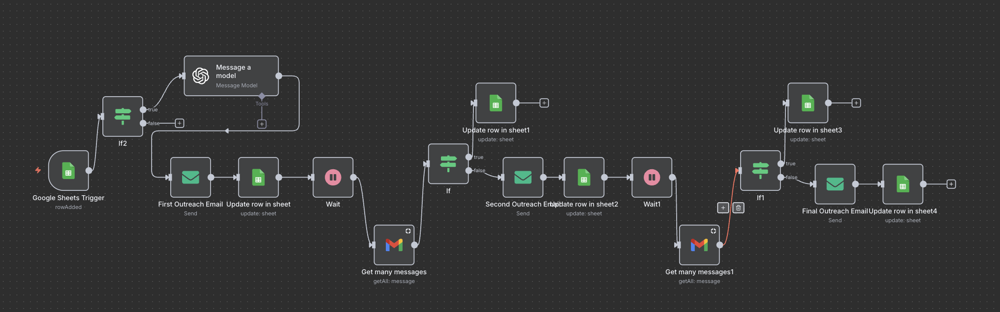

# Recruiter Outreach Agent 

This project automates recruiter outreach using **n8n**, Google Sheets, Gmail, and OpenAI.  

---

## 🚀 Workflow Preview  

Here’s how the automation looks in n8n:  



---

## ✨ Features  

- Auto-generates recruiter outreach emails personalized with company & role.  
- Tracks outreach attempts in Google Sheets.  
- Waits for recruiter replies before sending follow-ups.  
- Sends up to 2 follow-up emails if no reply.  
- Marks replies in the sheet automatically.  

---

 🛠 Setup Instructions  

```markdown
1. Open n8n locally  
- Start with Docker: 

```bash
docker run -it --rm \
  --name n8n \
  -p 5678:5678 \
  -v ~/.n8n:/home/node/.n8n \
  n8nio/n8n

2. Import the workflow JSON  

- Go to the `workflows/` folder.  
- Import `Recruiter_Outreach_Agent_Sanitized-2.json` into n8n.

3. Add credentials  

- Google Sheets → for tracking outreach & replies.  
- Gmail API → for sending/reading recruiter emails.  
- OpenAI API → for generating personalized outreach text.  
- SMTP (optional) → for fallback email sending.  

4. Run the workflow!  

- Add rows in Google Sheets → workflow triggers.  
- Emails are sent & tracked in the sheet.  
- Replies are detected automatically.  


